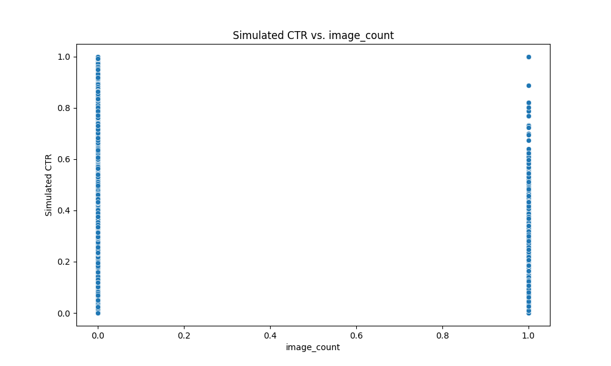

# Data Visualization Report

This report visualizes the key characteristics of the `labeled_waveui.csv` dataset.

## 1. Distribution of Simulated CTR

The distribution of the simulated Click-Through Rate (CTR) shows us the overall spread of our target variable.

The CTR is somewhat normally distributed but skewed slightly to the left, with most values concentrated between 0.1 and 0.7.

## 2. Feature Correlation Matrix

The heatmap shows the correlation between different features.

Key observations from the correlation matrix:
- `simulated_ctr` has a notable positive correlation with `avg_area` and `center_x` and `center_y`.
- `ui_complexity` is positively correlated with the counts of different UI elements, as expected.

## 3. CTR vs. Key Features

Scatter plots to visualize the relationship between key features and simulated CTR.

### CTR vs. avg_area

### CTR vs. ui_complexity

### CTR vs. text_density

### CTR vs. button_count

### CTR vs. link_count

### CTR vs. image_count

