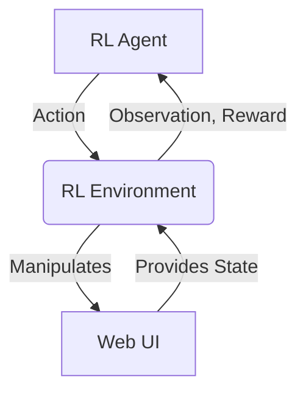

# PagePilot: An AI-Driven UI Optimization Platform - Project Report

## 1. Introduction
### 1.1 Project Overview
PagePilot is an innovative project that leverages Reinforcement Learning (RL) to autonomously optimize User Interface (UI) layouts for web applications. Its primary goal is to enhance key performance indicators such as Click-Through Rate (CTR) and overall user engagement by intelligently adjusting UI element properties.

### 1.2 Problem Statement
In the rapidly evolving digital landscape, effective UI design is paramount for user experience and business success. However, the process of optimizing UI elements—such as button placement, size, and contrast—is traditionally manual, time-consuming, iterative, and often subjective. While methods like A/B testing provide valuable insights, they are typically limited to a few predefined variations and lack the dynamic adaptability required to respond to real-time user behavior or changing design objectives.

### 1.3 Proposed Solution
PagePilot proposes an AI-driven solution using Reinforcement Learning. By treating UI optimization as a sequential decision-making problem, an RL agent can learn optimal strategies through continuous interaction with a web environment. This approach allows for the discovery of non-obvious optimal layouts and provides a framework for dynamic adaptation, moving beyond the limitations of static, rule-based systems.

## 2. System Design
### 2.1 Architecture Overview
The PagePilot system is composed of three main high-level components:
1.  **Web UI**: The target web application whose UI is to be optimized.
2.  **RL Environment**: An interface that allows the RL agent to interact with the Web UI, observe its state, execute actions, and receive rewards.
3.  **RL Agent**: The core learning component that determines the optimal policy for UI manipulation.

### 2.2 Component Breakdown
#### 2.2.1 Web UI (`local_web/`)
This component consists of the HTML and CSS files that define the structure and styling of the web page to be optimized. It includes a main container (`#element-container`) within which a Call-to-Action (CTA) button (`#cta-button`) is placed. This button is the primary target for the RL agent's optimization efforts.

#### 2.2.2 RL Environment (`rl_env.py`)
The `rl_env.py` file implements a custom OpenAI Gym-compatible environment (`PagePilotEnv`). Its role is to bridge the gap between the RL agent and the Web UI.

*   **State Observation**: The environment observes the state of the CTA button, specifically its `x`, `y` coordinates, `width`, and `height`. These raw pixel values are then normalized (scaled between 0 and 1) to provide a consistent input for the neural network, regardless of screen size or container dimensions.
*   **Action Execution**: The environment translates discrete actions from the RL agent (e.g., move up, move down, increase width) into direct manipulations of the CTA button's CSS properties (`top`, `left`, `width`, `height`) using Playwright.
*   **Reward Calculation**: A heuristic reward function is designed to guide the agent towards optimal UI configurations. This function considers:
    *   **Position Reward**: Higher for buttons closer to the visual center of the container.
    *   **Size Reward**: Higher for larger buttons, up to a reasonable limit.
    *   **Contrast Reward**: Higher for buttons with sufficient color contrast against their background, promoting accessibility and visibility.
    *   **Boundary Penalty**: A significant negative reward is applied if the button moves outside the designated `#element-container` boundaries.
*   **Environment Reset**: The environment can be reset to its initial state, reloading the web page to ensure consistent starting conditions for each training episode.
*   **Technologies**: Utilizes `gym` for the environment interface and `playwright` for headless browser automation and web element interaction.

#### 2.2.3 RL Agent (`dqn_trainer.py`)
The `dqn_trainer.py` file contains the implementation of the Deep Q-Network (DQN) agent, responsible for learning the optimal policy for UI manipulation.

*   **DQN Neural Network**: A multi-layered perceptron (MLP) that approximates the Q-value function, mapping observed states to expected future rewards for each possible action.
*   **Replay Buffer**: Stores past experiences (state, action, reward, next_state, done) to break temporal correlations and improve learning stability. Experiences are sampled randomly in batches for training.
*   **Target Network**: A separate, periodically updated network used to calculate target Q-values, which helps stabilize the training process by providing a fixed reference for a period.
*   **Training Process**: The agent employs an epsilon-greedy exploration strategy, balancing exploration of new actions with exploitation of known good actions. During training, it samples batches from the replay buffer, calculates the Q-learning loss, and updates the policy network using an Adam optimizer with gradient clipping.

#### 2.2.4 Configuration (`config.py`)
The `config.py` file centralizes various hyperparameters for the RL environment and the DQN trainer, as well as file paths for models and screenshots. This allows for easy tuning and management of experimental settings.

## 3. Implementation Details
### 3.1 Development Environment
The project is developed using Python, leveraging `uv` for dependency management and execution. Key libraries include `playwright` for browser automation, `torch` (PyTorch) for deep learning, and `gym` for the reinforcement learning environment framework.

### 3.2 Web UI Implementation
*   `index.html`: Defines the basic structure of a modern web page, including a navigation bar, a hero section, and a footer. The `#element-container` is integrated into the hero section, and the `#cta-button` is placed within it. To ensure the RL agent has a clear optimization task, the initial position of the `#cta-button` is set to a sub-optimal location (e.g., top-left corner) using inline CSS.
*   `style.css`: Provides comprehensive styling for all elements, including responsive design principles, modern typography, color schemes, and interactive effects for the navigation bar, hero section, and the CTA button. Obstacle elements were removed to focus on a more realistic service UI.

### 3.3 RL Environment Implementation
*   `PagePilotEnv` class:
    *   `__init__`: Initializes Playwright, loads the local HTML file, defines the action space (8 discrete actions for movement and resizing), and sets up the normalized observation space (4 continuous values between 0 and 1 for x, y, width, height).
    *   `_get_state`: Retrieves the current bounding box of the CTA button and normalizes its `x`, `y`, `width`, and `height` values relative to the `#element-container`'s dimensions. This ensures that the state representation is consistent across different container sizes.
    *   `_calculate_reward`: Computes the heuristic reward based on the normalized state. It calculates position, size, and contrast rewards, applying a severe penalty if the button moves outside the normalized boundaries (0 to 1 range).
    *   `step`: Takes an action, converts the normalized action amount back to pixel values, applies the changes to the button's CSS using Playwright's `page.evaluate`, retrieves the new normalized state, calculates the reward, and determines if the episode is done.
    *   `reset`: Reloads the web page to reset the environment to its initial state for a new episode.
    *   `render`: Captures screenshots of the web page, useful for visualizing the agent's progress.

### 3.4 RL Agent Implementation
*   `DQN` class: Defines a simple feed-forward neural network with two hidden layers (128 neurons each) and ReLU activations, outputting Q-values for each action.
*   `ReplayBuffer` class: Implemented using `collections.deque` to store a fixed-size history of transitions. It provides methods to `push` new experiences and `sample` random batches for training.
*   `train_dqn` function: Orchestrates the entire training process:
    *   Initializes the environment, policy network, and target network.
    *   Iterates through a predefined number of episodes.
    *   Manages epsilon-greedy exploration, gradually decaying epsilon over time.
    *   Collects experiences and stores them in the replay buffer.
    *   Performs Q-learning optimization steps by sampling batches from the replay buffer, calculating the Huber loss (`smooth_l1_loss`), and updating the policy network using the Adam optimizer with gradient clipping.
    *   Periodically updates the target network's weights from the policy network.
    *   Saves the trained model.

## 4. Challenges and Solutions
Throughout the development of PagePilot, several significant challenges were encountered, leading to iterative refinements:

### 4.1 Initial Problem Design
**Challenge**: The initial placement of the CTA button was often near optimal, providing little incentive for the RL agent to learn significant movements or changes.
**Solution**: The `index.html` was modified to place the CTA button in a sub-optimal starting position (e.g., top-left corner), forcing the agent to learn to move it towards the optimal central location.

### 4.2 Learning Issues (Consistent Negative Rewards)
**Challenge**: The agent consistently received severe negative rewards, indicating it was immediately moving the button out of bounds in almost every step, preventing any meaningful learning.
**Solutions Implemented:**
*   **Mismatch in Reward Calculation**: Initially, the reward function mixed normalized state values with unnormalized container dimensions for boundary and position calculations.
    **Solution**: `rl_env.py` was updated to normalize `container_center_x`, `container_center_y`, `max_distance`, and `max_area` within the `__init__` method, ensuring all reward calculations operate on a consistent normalized scale.
*   **Action Scaling Inconsistency**: The `move_amount` and `size_amount` were fixed pixel values, which, when applied to a normalized state space, could result in disproportionately large jumps, easily pushing the button out of bounds.
    **Solution**: The `step` function in `rl_env.py` was modified to normalize `move_amount` and `size_amount` based on the container's dimensions before applying them. This ensures that actions correspond to consistent movements within the normalized observation space.
*   **Reward Scaling**: The initial reward scaling factor (`REWARD_SCALE`) was too high, leading to very large reward values that might have made the learning process unstable.
    **Solution**: The `REWARD_SCALE` was removed from `_calculate_reward` in `rl_env.py`, allowing the rewards to naturally fall within the `[-1, 1]` range, which is more typical for stable RL training.

### 4.3 Ongoing Challenges
Despite the implemented solutions, the agent is still observing consistent negative rewards in recent training runs. This suggests that further debugging, hyperparameter tuning, or potentially a re-evaluation of the reward function or action space design is necessary to enable effective learning.

## 5. Future Work
The PagePilot project lays a strong foundation for future advancements in AI-driven UI optimization:

### 5.1 Advanced Reward Functions
Explore more sophisticated reward mechanisms beyond the current heuristic. This could involve integrating real user data (e.g., simulated eye-tracking heatmaps, actual click data from A/B tests), or incorporating direct user feedback into the reward signal (Human-in-the-Loop RL) to capture more nuanced aspects of user engagement.

### 5.2 Expanded Action Space
Extend the agent's capabilities to modify a wider range of UI properties. This includes changing colors, fonts, text content, element types (e.g., button to link), or even dynamically adding/removing elements based on learned policies.

### 5.3 More Complex Environments
Introduce dynamic elements (e.g., pop-ups, animations), multiple interactive UI components, or different page layouts (e.g., multi-column designs, responsive layouts) to increase the complexity and realism of the optimization task.

### 5.4 Transfer Learning
Investigate strategies for training the agent on a large corpus of synthetic UI data and then fine-tuning it on specific real-world UIs. This could accelerate learning and improve generalization across diverse web applications.

### 5.5 Human-in-the-Loop RL
Develop interfaces that allow designers and users to provide real-time feedback to guide the agent's learning process. This collaborative approach can combine the efficiency of AI with human intuition and creativity.

### 5.6 Different RL Algorithms
Experiment with other state-of-the-art RL algorithms (e.g., Proximal Policy Optimization (PPO), Soft Actor-Critic (SAC)) that might offer better sample efficiency, stability, or handle continuous action spaces more naturally, especially if the action space is expanded.

### 5.7 Real-world Deployment
Develop mechanisms to integrate PagePilot with actual web analytics platforms and content management systems for live UI optimization and automated A/B testing in production environments.

### 5.8 Multi-objective Optimization
Consider optimizing for multiple, potentially conflicting, objectives simultaneously (e.g., maximizing CTR while minimizing page load time, or balancing user engagement with accessibility scores).

## 6. Conclusion
PagePilot represents a significant step towards automated and intelligent UI optimization. By combining the power of Reinforcement Learning with robust web automation, it offers a promising avenue to overcome the limitations of traditional UI design processes. While current challenges exist, the foundational work laid and the clear path for future development underscore its potential to revolutionize how web interfaces are designed and optimized for maximum user engagement and business impact.